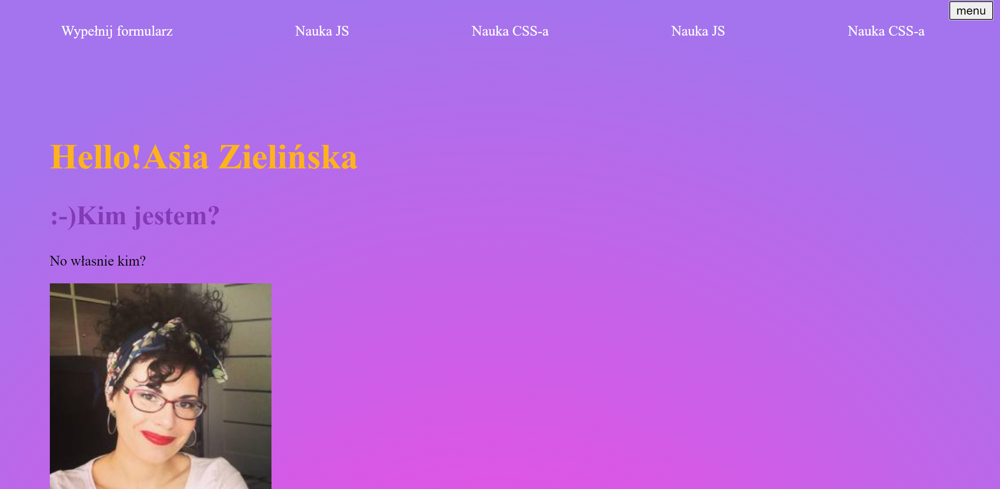

# Homepage Asi Z

Moja strona domowa :)) 

## Jak to  odpalić?

Najpierw zrób `npm install`, a później masz następujące opcje:

`npm run start` - runs development mode

`npm run build` - runs build process for production

`npm run publish` - runs build process and publish the page using `gh-pages` branch

### Prace domowe 

Pierwsza praca domowa
to stworzenie tego artykułu i notatek z kursu uczę się tworzyć plik html, znaczników i mam sprawdzić ten tekst za pomocą Validatora, następnie dodać style w homepage utworzyć plik style.css, następnie ustawić tło strony na #fefefe, ustawic kolor nagłówków h2 na 1460AA a następnie rozwiązać zagadkę umieszczoną na codepenie (https://codepen.io/maciejkorsan/pen/8db755719dea64797342e1840ff2b7ee).Następnie napisać algorytm prostej czynności - "Myśl jak programiści". Na koniec zmienić treść żywej strony - "Zrób komuś kawał":).

Druga praca domowa
Założyć tablicę na trello i wrzucać tam pracę domowe oraz śledzić swój postęp. Rozbudować homepage ( W homepage stworzyć kolejne pliki, do każdego pliku dodać jakieś zdjęcie, stworzyć nawigację pomiędzy plikami Pamiętać o formatowaniu i sprawdzeniu kodu w validatorze). Dodać klady (Uzupełnić HTMLA o klasy i utworzyć odniesienia do nich w stylach, Nadać style nagłówkom za pomocą klas - pamiętając o odpowiednim nazewnictwie, NIE BAĆ SIĘ EKSPERYMENTOWAĆ ! ) Przejść labirynt w terminalu udostępnionym przez Korsana.

Trzecia praca domowa
1.Założyć konto na gitHubie, 2.Wrzucić projekt homepage na githuba(założyć repozytorium lokalne), 3.Zacznij commitować zmiany, 4.Dostosuj style tak, aby ograniczyć szerokość treści i ją wyśrodkuj (np.na main użyć szerokości nie większej niż 1000px). 5.Dostosuj projekt homepage do BEM. 6.Stwórz pusty element z wybraną klasą i uzupełnij go za pomocą JS.

Czwarta praca domowa
1.Utwórz funkcję powitalną jako parametr niech przymuje imię i wiek. 2. "Potnij wizytówkę" Załóż osobiste repozytorium. 3.wyśrodkuj linki w nawikacji za pomocą flexboxa. 4.Stwórz gradient i dodaj go jako tło do strony. 5. Przejdź flexbox froggsy.

Piąta praca domowa
1.Dodaj grid na swojej stronie. 2.Dodaj responsywność do swojej strony(media queries) 3.Dodaj do nawigacji na stronie 'hamburgera' 4.Uruchom github pages w repozytorium ze swoją stroną/wizytówką 5.Przejdź grid graden 6.Stwórz nowy projekt z prostym formularzem, action:"https://dev.cotenfrontend.pl" potestuj różne typy inputów i zobacz co jest przesyłane. Bonus:Stwórz 2 pola name oraz riddle. Jako wartość riddle wpisz cotenfrontend wartość name to Twoje imię. Wyślij taki formularz metodą post pod podany wyżej action.